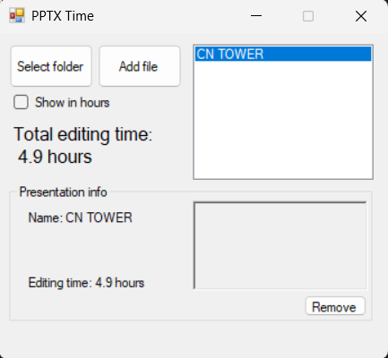

# PPTX Time

Simple tool to see how much time you spent making presentations in your favorite PowerPoint app.

It works by extracting ```docProps/app.xml``` from PPTX file (it's an archive itself) and reading ```TotalTime``` attribute.

You can view this data from Properties -> Details in Explorer, but this tool allows you to do this in bulk and reporting total time you have spent working on these great presentations.

## Features

* Bulk processing (folder selection)
* Thumbnail preview
* Total time report

## Screenshots
